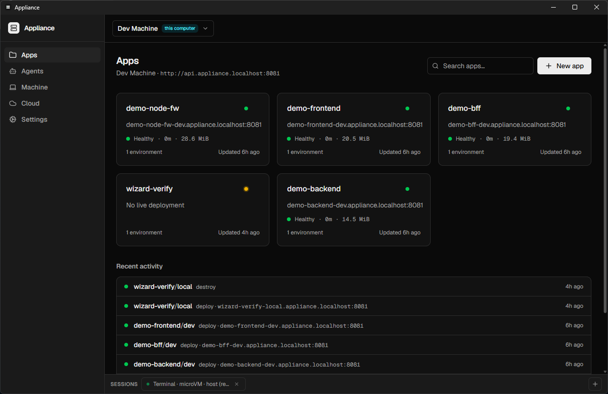
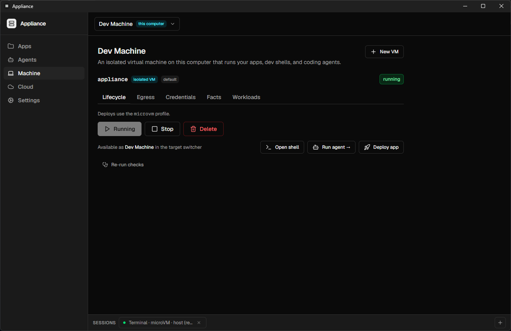
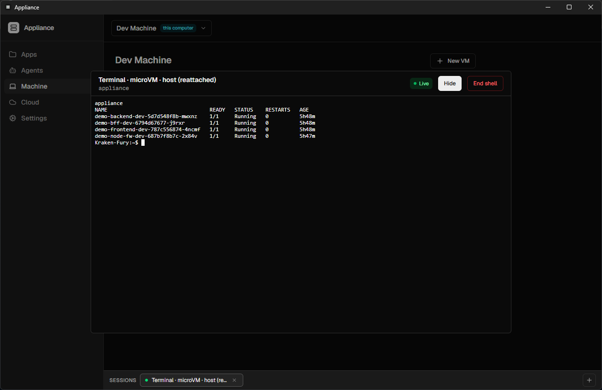
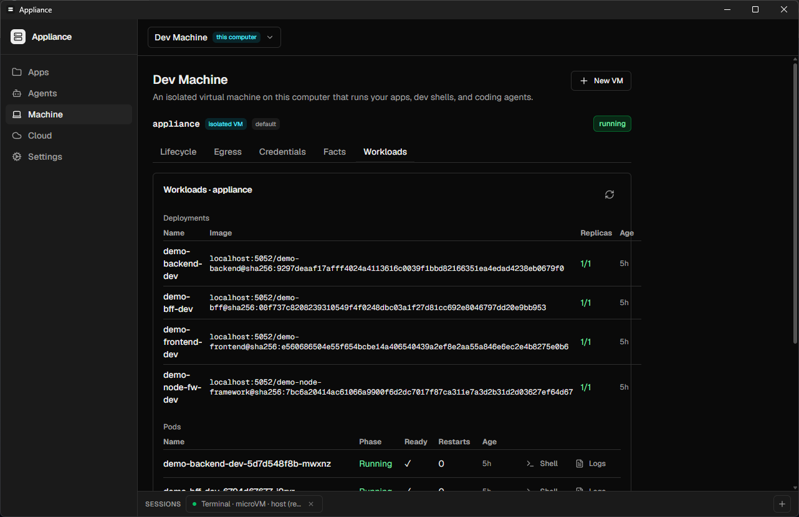
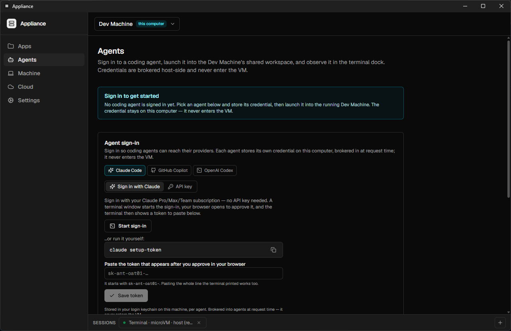
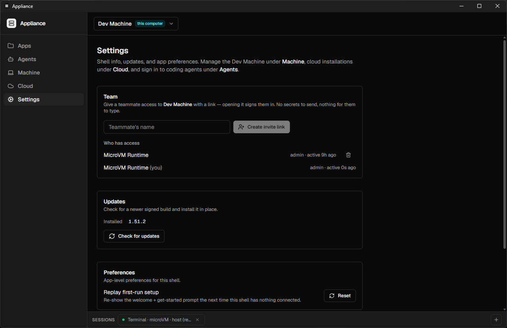

# The Appliance desktop app

The desktop app is the zero-terminal surface for everything the `appliance`
CLI does: it boots and manages the **Dev Machine** (the one managed microVM),
deploys and monitors apps, runs coding agents in the sandbox, and connects to
cloud installations — all from one window. It ships for **macOS**
(Virtualization.framework) and **Windows** (WSL2); the same UI is served as a
web console by every api-server at `http://api.appliance.localhost:8081`,
with the desktop-only surfaces (VM lifecycle, terminals, agents) gated to the
desktop shell.

> **Windows prerequisite:** WSL2. If `wsl --status` reports no WSL, run
> `wsl --install` once and reboot. macOS needs nothing.

## First run

On a machine with nothing configured, the app opens on a **Get started**
screen with one primary action — _Set up local runtime_. Clicking it installs
the bundled microVM engine, boots the Dev Machine with live phase progress
(`Media → Booting → Network → Cluster → Ready`), saves the local profile, and
lands you on a **Deploy your first app** call-to-action. No terminal, no
Docker, no image pulls.

If a teammate sent you an **invite link** instead, opening it signs you into
their installation directly — nothing to paste (see [Team](#settings--team)).

## Apps

The home page: every app on the selected target, its health, live URL, and
recent deploy activity. **New app** opens the deploy wizard — pick a folder,
confirm the detected configuration, and it uploads the source, builds
server-side, and rolls out.

## Machine

The **Dev Machine** page manages the one microVM that powers everything
local: lifecycle (start / stop / delete), and per-tab surfaces for the
**egress firewall**, the **credential broker**, VM **facts** (ports,
endpoints), and live **workloads**.

**Open shell** drops a real terminal into the VM in the persistent dock at
the bottom of the window. Shells are backed by tmux sessions inside the guest,
so they survive hiding the dock, navigating between pages — even restarting
the desktop app, which reattaches them:

The **Workloads** tab reads deployments, pods, and services through the
api-server, with per-pod **Shell** and **Logs** actions:

## Agents

Run coding agents (Claude Code, GitHub Copilot, OpenAI Codex) inside the Dev
Machine's shared workspace. Sign in once per provider — the credential is
stored in your OS keychain **on the host** and injected per-request by the
egress broker; it never enters the VM. Launched agents appear as observable
terminal tabs in the dock and in the **Runs** list with live status.

Launching agents requires the Dev Machine to be started **as a dev
environment** (a shared workspace folder mounted at `/persist/workspace`) —
the page guides you there when it isn't.

## Cloud

Provision a full Appliance installation on AWS (the same
`appliance cloud bootstrap` flow, with a wizard), connect to an existing
installation by URL, and run lifecycle operations — update the baseline,
update the api-server, promote/demote installer state, destroy.

## Settings — Team

Settings covers app updates, preferences, and **Team**: type a teammate's
name, click **Create invite link**, and send them the link — opening it signs
them in with their own member-scoped credential. No server URL or secret to
share.

## How it works (pointers)

- The shell is Tauri 2 (`packages/desktop`); the UI is `packages/app`,
  shared with the web console. Desktop-only capabilities are host-gated —
  the web build renders nothing for them.
- The microVM engine (`appliance-vm`) ships inside the app bundle and is
  installed to `~/.appliance/bin` on demand; the bundled `appliance` CLI
  drives bring-up so desktop and CLI share one implementation.
- On macOS, VM shells ride a vsock relay socket. On Windows, the guest **is**
  a WSL2 distro and shells ride `wsl.exe` directly — same in-guest tmux
  sessions, same reattach semantics.
- Credentials: the OS keychain is canonical on macOS; on Windows/Linux the
  CLI-shared `~/.appliance/profiles.json` (0600) is canonical. The desktop
  and CLI see the same clusters either way (see
  [credentials.md](credentials.md)).

For the build-from-source and release/signing story, see
[`packages/desktop/README.md`](../packages/desktop/README.md).
